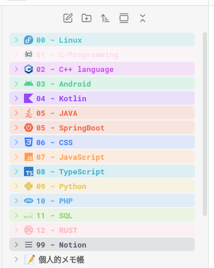
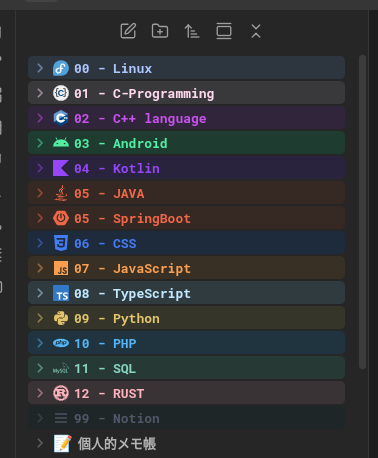

# Obsidian-Colored-Sidebar (Japanese Customized Version)

 &nbsp;&nbsp;&nbsp;&nbsp;



このリポジトリは、Obsidianのサイドバーにあるフォルダをカラフルに装飾するためのCSSスニペットです。

Travis Abendshien氏の [Obsidian-Colored-Sidebar](https://github.com/original-repo-url) をベースに、日本語環境向けの調整と、コードの整理（リファクタリング）を行いました。

## 🚀 オリジナルからの変更点
* **日本語対応:** 説明を日本語化しました。
* **コードの最適化:** 内部構造をリファクタリングし、カスタマイズしやすくしました。
* **[その他の変更点]:** (例：配色の変更、対象プレフィックスの変更などがあれば記載)

## 📦 インストール方法
1. このリポジトリから `[あなたのCSSファイル名].css` をダウンロードします。
2. Obsidianの `設定` -> `外観` -> `CSSスニペット` を開きます。
3. フォルダアイコンをクリックしてスニペットフォルダを開き、ダウンロードしたファイルを入れます。
4. Obsidian側で「再読み込み」を押し、スイッチをONにします。

## 使い方 (How It Works)
※以下はあなたのコードの仕様に合わせて書いてください
デフォルトでは、フォルダ名の先頭に `00` ～ `12` の数字をつけると、自動的に色が付きます。
例: `00_Inbox`, `01_Projects` ...

## カスタマイズ方法
`[あなたのCSSファイル名].css` をテキストエディタで開き、以下の変数を変更することで好みの色にできます。
### 1. 色を変更する
ファイルの冒頭にある `:root` セクションを探してください。ここに色の設定（変数の定義）がまとまっています。
`#` で始まるカラーコード（例: `#ff0000`）を書き換えることで、好きな色に変更できます。

```css
/* 設定例 */
:root {
  /* ================================ Colors ================================ */
  ...省略 
  --soft-blue: #aec6ff;          /* Default Prefix: 00 */
  --pale-pink: #ffd8ee;          /* Default Prefix: 01 */
  --purple: #c952ed;             /* Default Prefix: 02 */
  --mint: #52eea3;               /* Default Prefix: 03 */
  --violet: #9446f8;             /* Default Prefix: 04 */
  --orange: #ee6748;             /* Default Prefix: 05 */
  --blue: #437cf3;               /* Default Prefix: 06 */
  ...省略
```

### 2. 対象のフォルダ名（プレフィックス）を変更する

デフォルトでは 00 や 01 などの数字に反応しますが、これを main や log などの単語に変えることも可能です。
ファイル内で data-path^="00" のように書かれている箇所を検索し、" " の中身を任意の文字に書き換えてください。
#### 変更前: "00" で始まるフォルダに適用 

`.nav-folder-title[data-path^="00"] ...`

#### 変更後: "project" で始まるフォルダに適用する場合

`.nav-folder-title[data-path^="project"] ...`

### 3.  ⚠️ フォルダ（プレフィックス）を追加する際の注意点

新しいフォルダ番号（例: `13` や `project` など）を追加する場合は、色の定義だけでなく、**「Generic Prefix Styles」セクションへの追記も必須です。**

前半で色（変数）を定義しただけでは、Obsidian側はその色をどう表示していいか分からないので、
後半にある `Generic Prefix Styles` 内のリストにも同じプレフィックスを追加することで、初めて色が適用されます。

**手順:**
1. ファイル前半で色変数を定義する。
2. ファイル後半の `Generic Prefix Styles` にある**全てのリスト（カンマ区切りの箇所）**に、新しいプレフィックスの行を追加する。
```css


   /* --------------------------- Generic Prefix Styles -------------------------- */
   .nav-folder-title[data-path^="11"],
   .nav-folder-title[data-path^="12"],
   /* ここに新しい行を追加します（例: 13番を追加する場合） */
   .nav-folder-title[data-path^="13"],

    /* ⚠️ 注意:
    * このファイル内には同様のリスト定義が下に続きます。
    * 必ず【合計4箇所】すべてに同じ行を追加してください。
    * 1箇所でも忘れると、ホバー時の挙動やアイコンの色が正しく反映されません。
      */
```
---
## Credits / 謝辞
* Forked from: [Obsidian-Colored-Sidebar](https://github.com/CyanVoxel/Obsidian-Colored-Sidebar) by Travis Abendshien
* Inspired by: "Coloured Folders" snippet by Lithou
* Original License applies.